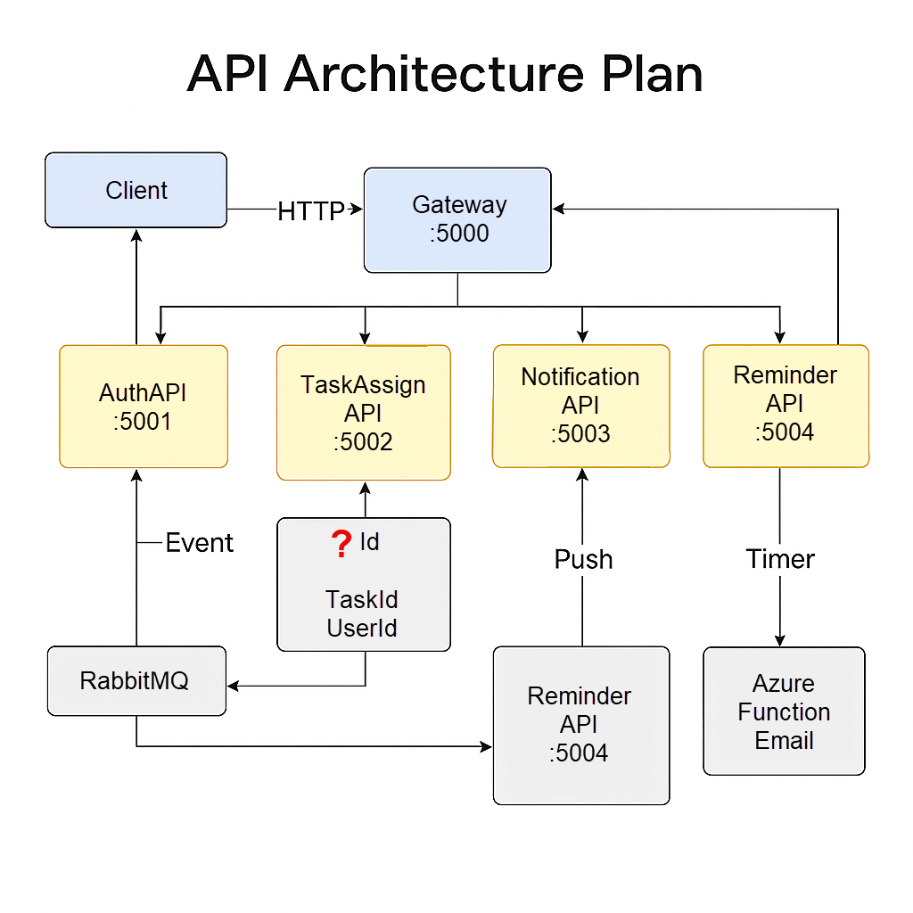
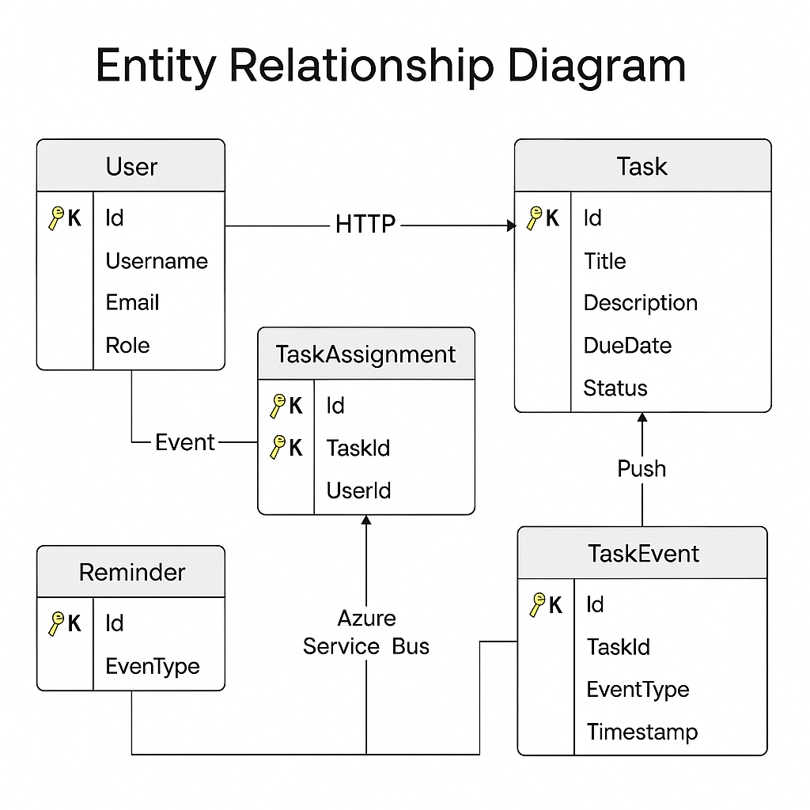

# 🧠 Smart Task Management System

A full-stack, production-ready Microservices-based solution powered by **.NET Core 8**, **Azure**, **RabbitMQ**, **IdentityCore**, and **ASP.NET Core MVC**.

---

## 📁 Solution Structure

```
/SmartTaskSolution
│
├── /Services
│   ├── /AuthService       (.NET 8 + IdentityCore)
│   ├── /TaskService       (.NET 8 + EF Core)
│   ├── /NotificationSvc   (.NET 8 + RabbitMQ + Azure Function)
│   ├── /ReminderService   (Azure Function)
│   └── /Gateway           (.NET 8 + Ocelot)
│
├── /Frontend              (ASP.NET Core MVC + Bootstrap)
├── /Shared                (DTOs, Common Utils)
└── /Docs                  (This checklist)
```

---

## 🌐 Microservices API Chart

| Service Name         | Port  | Key Endpoints                       | Description                     |
|----------------------|-------|--------------------------------------|---------------------------------|
| API Gateway          | 5000  | `/api/*`                             | Ocelot routing layer            |
| Auth Service         | 5001  | `/login`, `/register`               | JwtBearer, IdentityCore         |
| Task Service         | 5002  | `/task/create`, `/assign`, `/update`| Task operations + RabbitMQ emit |
| Notification Service | 5003  | (RabbitMQ consumer)                 | Task notification trigger       |
| Reminder Service     | 5004  | (Azure Bus listener)                | Email on task inactivity        |
| Frontend MVC         | 5005  | `/login`, `/dashboard`, `/tasks`    | UI views with Razor & Bootstrap |

---

## 🌐 API Architecture Plan

A high-level overview of how each microservice interacts in the Smart Task Management System.

---

### 🔁 Service Interaction Map - Architecture Plan



> 📌 Each arrow represents the direction and type of communication between services. Ports are labeled for service accessibility through the Gateway.

> 📌 All services are stateless, decoupled, and accessed via the API Gateway with secure JWT tokens.

---

## 🗺️ Microservices (API) Endpoint Map

| Service              | Port  | Method     | Endpoint                     | Description                     |
|----------------------|-------|------------|------------------------------|---------------------------------|
| API Gateway          | 5000  | ALL        | `/api/*`                    | Aggregator & router              |
| Auth Service         | 5001  | POST       | `/login`                    | Authenticate & issue JWT         |
|                      |       | POST       | `/register`                 | Create user with role            |
| Task Service         | 5002  | POST       | `/task/create`              | Create new task                  |
|                      |       | POST       | `/task/assign`              | Assign user to task              |
|                      |       | PUT        | `/task/status/update`       | Update task status               |
|                      |       | GET        | `/task/{id}`                | Get task by ID                   |
| Notification Service | 5003  | EVENT      | `task.events` (RabbitMQ)    | Emits & listens to task changes  |
| Reminder Service     | 5004  | TIMER/EVENT| —                           | Checks task inactivity           |
| Azure Function Email | —     | TRIGGER    | `emailQueue` (Service Bus)  | Sends assignment/reminder email  |
| MVC Frontend         | 5005  | GET/POST   | `/login`, `/dashboard`      | UI layer for all services        |

> 🔒 All `/api/*` routes are protected via JWT and forwarded through Ocelot Gateway. RabbitMQ and Azure Service Bus operate independently of HTTP flows.

---

### 🔐 JWT Flow Summary

1. User logs in via `/login` (Auth Service)
2. Auth Service returns JWT token with embedded claims
3. Client sends token to Gateway
4. Gateway forwards request with token to appropriate service

---

### 📬 Messaging Flow

#### RabbitMQ
- **Producer:** Task Service
- **Exchange:** `task.exchange`
- **Queue:** `task.events`
- **Consumer:** Notification Service

#### Azure Service Bus
- **Trigger:** Notification or Reminder Service
- **Queue:** `emailQueue`
- **Consumer:** Azure Function (Email Dispatch)

---

## 🧬 Entity Relationship Overview: Normalized & Indexed



> ✅ Includes primary/foreign keys, normalized entities, and suggested indexes for optimized querying.

---

## ✅ Implementation Checklist

### 📁 Planning
- [ ] Define BRD and scope
- [ ] Design database schemas for each microservice
- [ ] Allocate service ports & API chart
- [ ] Communication breakdown map (RabbitMQ + Azure Bus)

### 🔌 API Development

#### Auth Service
- [ ] JwtBearer token via `/login`
- [ ] User registration `/register`
- [ ] IdentityCore setup + roles
- [ ] Claims embedded in token

#### Task Service
- [ ] `/task/create`, `/assign`, `/update`
- [ ] Push event to RabbitMQ

#### Notification Service
- [ ] RabbitMQ subscription
- [ ] Forward to Azure Service Bus
- [ ] Trigger Azure Function → send email

#### Reminder Service
- [ ] Track inactivity via timers/calendar
- [ ] Azure Bus → send reminder email

#### Gateway
- [ ] Ocelot routing + policies
- [ ] JWT validation

---

### 🎨 Frontend (MVC App)
- [ ] Login/Register Razor Views
- [ ] Bootstrap 5 theme
- [ ] Task dashboard & creation UI
- [ ] Reminder interval UI
- [ ] DI via `IHttpClientFactory` + JWT header inject

---

### 📬 Messaging & Integration

#### RabbitMQ
- [ ] Exchange: `task.exchange`
- [ ] Queue: `task.events`

#### Azure
- [ ] Service Bus Queue: `emailQueue`
- [ ] Functions: `onTaskAssigned`, `onTaskCompleted`, `onTaskInactive`
- [ ] Email: SendGrid or ACS integration

---

## 📦 Final Tech Stack by Component

| Component             | Stack                                            |
|-----------------------|--------------------------------------------------|
| Auth Service          | .NET Core 8, IdentityCore, Azure SQL            |
| Task Service          | .NET Core 8, EF Core, RabbitMQ, Azure SQL       |
| Notification Service  | .NET Core 8, Azure Function, RabbitMQ, SendGrid |
| Reminder Service      | Azure Function, Azure Service Bus               |
| Gateway               | ASP.NET Core 8 + Ocelot                         |
| MVC Frontend          | ASP.NET Core MVC, Razor, Bootstrap              |

---

## ⏭️ Kickoff
- [ ] Start with **Step 01: Auth Service Setup**
